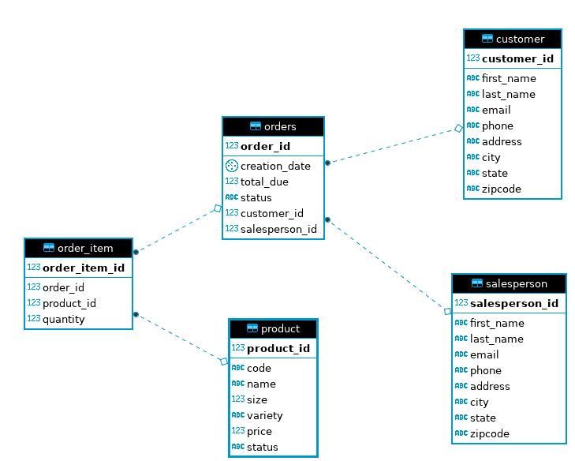
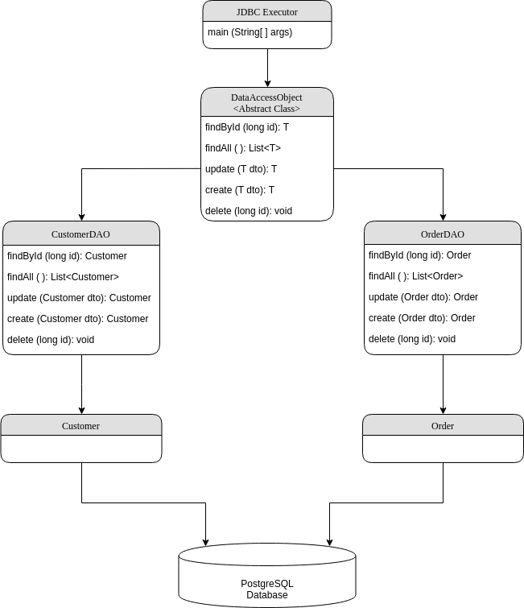

# Introduction
This is a data processing application which allows user to connect
to PostgreSQL database and perfrom actions to the tables. The application
implements CRUD functionailty with JDBC APIs, which allow users to create,
read, update and delete in PostgreSQL RDBMS.

# ER Diagram

# Architecture Diagram

# Design Patterns
Data Access Object Pattern or DAO pattern is used in the application, which separate low
level data accessing API or operations from high level business services. Create an
abstract class `DataAccessObject` which is extended by two implementation classes `CustomerDAO` and `OrderDAO`. 
These two classes are used to transfer DTOs Customer and Order to PostgreSQL 
database to perform CRUD operation.