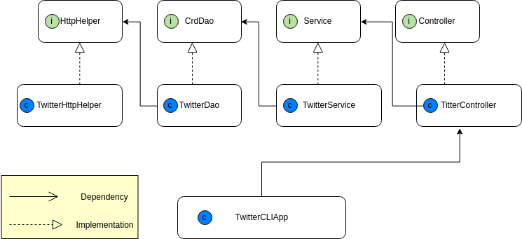

# Introduction
The Java Twitter App is an command line application that allows user to Create, Read
and Delete Tweets. It connects to Twitter API through OAuth and 
perform part of CRUD implementation. Post and Get request was used, and
the Tweet returned was process using DAO design pattern.
# Design
 UML diagram
 
 

###TwitterHttpHelper
Implements HttpHelper interface, connects the application with Twitter.

###TwitterDao
Implements CrdDao class, create URI with Tweet objects.

###TwitterService
Implements Service class, validate inputs for the Tweet

###TwitterController
Implements Controller class, validate command line inputs

###TwitterCLIApp
Gathers the input, and invokes method form TwitterController
# Quick Start
Before running the application you need to set up the following 
environmental variables `consumerKey`, `consumerSecret`, `accessToken`
, `TokenSecret`. 

Setup Maven: Go to Twitter directory and run `mvn package`

Run Application: Go to Twitter directory and run `java -jar target/
java_apps-1.0.0-SNAPSHOT.jar [action] [option]`

###action
Post:
`TwitterCLIApp post "text" "Longitude:Latitude"`

Show:
`TwitterCLIApp show "Id" "fields"`

Delete:
`TwitterCLIApp delete "ids"`   `ids` is an array of id 

# Model
The model we used is an simplified version of the Tweet model.
We implemented `Tweet`, `Coordinates`, `Entities`, `Hashtag`, `Tweet`,
 `UserMention`. Below is an example of the simplified Tweet
 Object.
 ```
{
   "created_at":"Mon Feb 18 21:24:39 +0000 2019",
   "id":1097607853932564480,
   "id_str":"1097607853932564480",
   "text":"test with loc223",
   "entities":{
      "hashtags":[],      
      "user_mentions":[]  
   },
   "coordinates":null,  
   "retweet_count":0,
   "favorite_count":0,
   "favorited":false,
   "retweeted":false
}
```
# Improvements
1. Allow user to post photo or videos.

2. Implement fields option for show command.

3. Allow user to see other user's tweet.