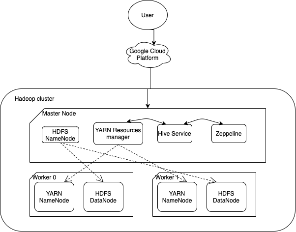

Table of contents
* [Introduction](#Introduction)
* [Hadoop Cluster](#hadoop-cluster)
* [Docker Deployment](#hive-project)
* [Improvements](#improvements)

# Introduction
The Hadoop project uses Core Hadoop Component, including HDFS, MapReduce, YARN, Hive.
After completing the project, I understand the structure of HDFS, and have understanding of
MapReduce and YRAN. The project uses Apache Hive and Zeppline to process and analyze data.
Moreover, possible optimization techniques were used to speed up the processing time, such as Columnar File Optimization.
Google Cloud Platform is used to build the hadoop cluster, which contain one master node and two worker nodes.

# Hadoop Cluster
The project uses a 3 node cluster, 1master and 2 workers. The project is provisioned and hosted on Google Cloud Platform.

##Big Data Tools
- **HDFS (Hadoop Distributed File System):** is the primary data storage system that used by Hadoop applications. HDFS consists of one NameNode and multiple DataNodes.
	- **NameNode (The Master) :** is the master daemon that maintains and manages the data block present in the DataNodes. 
	- **DataNode (The Worker) :** is the place where actual data is stored. They will execute tasks given by the NameNode and send back the result. By default, each of the blocks gets replicated three times. If any of those replicas gets corrupted, there are others to restore it.
- **YARN (Yet Another Resource Negotiator) :** is the resource management and job scheduling technology in the Hadoop distributed framework.
	- **Resource Manager :** is responsible for managing global resources among all nodes. It is the highest authority to allocate resources among all applications.
	- **Node Manager :** is running on the worker node where it will gather hardware information and send it back to the Resource Manager. It is responsible  for managing resources at the machine level.
- **Hive :** is a data warehouse system built on top of Hadoop and is used for analyzing structured and semi-structured data. It provides a mechanism to project structure onto the data and perform queries written in HQL (Hive Query Language) that are similar to SQL statements. Internally, these queries or HQL get converted to map reduce jobs by the Hive compiler.
- **Zeppelins :** provides the user with a clean UL notebook to execute a large number of queries. It provides a way to apply markdown to easily and cleanly display HiveQL, bash command and output results.
- **Hardware Specifications :**
	- 1 master node
	- 2 worker nodes
	- 2 cores
	- 12GB of RAM
	- 100GB of disk space

# Hive Project
This Hive project is an introduction to how Hive and Zeppelin Notebook work. There are three main parts within this project: loading data into HDFS, optimization of queries and compare performance between hive and spark. The screen-shot below having detailed description and implementation of each task.

# Improvements
- Explore bucketing, possibly with a larger cluster.
- Try combining both partition optimization and columnar optimization and test how well it is.
- Improve the readability of my Zeppelin notebook, based on feedback.
