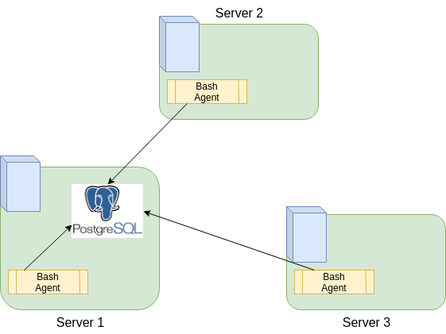

## Introduction
The Cluster Monitoring Solution is used to collect the hardware specifications of each node and monitor node resources usages. The data will be collected and stored in a RDBMS database. The report generated by these data will be use for future resource planning purpose.

## Architecture and Design
1) Cluster Diagram:

2) Tables
  All tables are created under `host_agent` database
  - `host_info`  table contains hardware specifications data.
  - `host_usage` table contains server CPU and memory usage data.
3) Scripts
  - `host_info.sh`  collect hardware specifications data and store it in `host_info` table.
  - `host_usage.sh` collect server CPU and memory usage data and store it in `host_usage` table. The script will be called periodically using scheduler.

## Usage
1) how to init database and tables (e.g. ddl.sql)
~~~
./psql_docker.sh start password (start docker)
psql -h localhost -U postgres -W -f sql/ddl.sql (create database and table)
~~~
2) `host_info.sh` usage
~~~
bash ./host_info.sh localhost 5432 host_agent postgres password
~~~
3) `host_usage.sh` usage
~~~
bash ./host_usage.sh localhost 5432 host_agent postgres password
~~~
4) crontab setup
~~~
crontab -e
* * * * * bash /home/centos/dev/jarvis_data_eng_james/linux_sql/scripts/host_usage.sh localhost 5432 host_agent postgres password > /tmp/host_usage.log
~~~
## Improvements
1) handle hardware update
2) Automate script to run all command
3) Alters when usage is consistently high 
