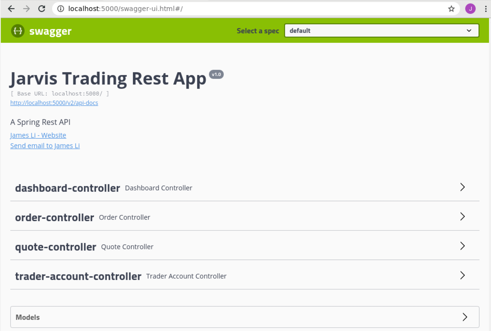
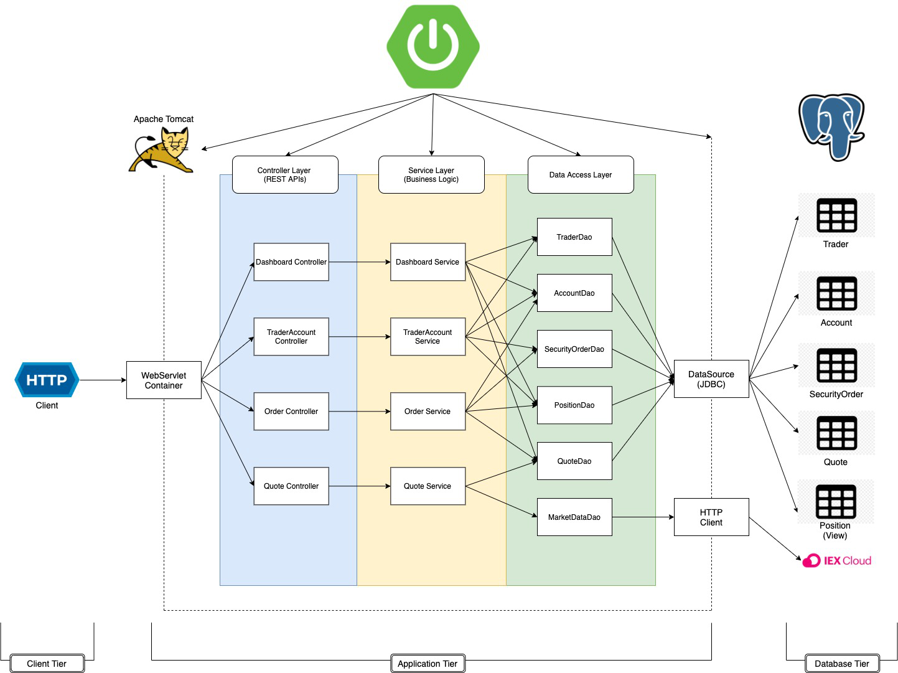
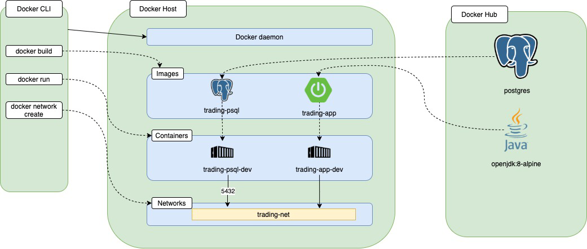

# Springboot Trading REST API
 * [Introduction](#introduction)
 * [Quick Start](#quick-start)
 * [Architecture](#architecture)
 * [REST API usage](#rest-api-usage)
 * [Docker Deployment](#docker-deployment)
 * [Improvements](#improvements)
## Introduction

This Java application is an REST API designed for online stock trading 
simulation. The application allows a trader to sell and buy stock. The 
application gathers market information from an online data sources IEX 
cloud ,and stores these information along with user information in a 
PostgresSQL database. Dependency management is done using SpringBoot and 
Maven. The target user for this application would be mobile or front-end 
developer.

## Quick Start
#### Prequiresites
Requirements to run this application:
- System: CentOS 7
- Java Version: 8 or higher
- Docker Version: 17.05 or higher
- Maven
- IEX account 

#### Docker Setup
This application contains two docker containers `trading-psql` and `trading-app`. In order to run the application deployment of Docker is required. Follow the script bellow to deploy Docker.
```
#run Docker
systemctl start docker

#create a Docker network
docker network create --driver bridge trading-net
#verify the network is created
docker network ls
```
Build image and create Docker container for `trading-psql`
```
#Build image
cd ./springboot/psql
docker build -t trading-psl .
docker image ls -f reference=trading-psl

#start a docker container 
#attached the container to the trading-net network 
docker run --name trading-psql-dev \ 
-e POSTGRES_PASSWORD=password \ 
-e POSTGRES_DB=jrvstrading \ 
-e POSTGRES_USER=postgres \ 
--network trading-net \ 
-d -p 5432:5432 trading-psql
```
Build image and create Docker container for `trading-app`, make sure to set up environment variable `IEX_PUB_TOKEN` with public token from IEX Cloud.
```
#Build image
cd ./springboot/ 
docker build -t trading-app .
docker image ls -f reference=trading-psl

#start trading-app container which is attached to the trading-net docker network 
docker run --name trading-app-dev \ 
-e "PSQL_URL=jdbc:postgresql://trading-psql-dev:5432/jrvstrading" \ 
-e "PSQL_USER=postgres" \ 
-e "PSQL_PASSWORD=password" \ 
-e "IEX_PUB_TOKEN=${IEX_PUB_TOKEN}" \ 
--network trading-net \ 
-p 5000:8080 -t trading-app
```



Screenshot of the Trading Application with SwaggerUI 
## Architecture
  
  
  
  The application uses Three-Tier Architecture consists of `Client Tier`, `Application Tier` and `Databse Tier`.
  The application and data store is decouple, so data will not be lost when an application instance crushed.
  - __Client Tier__:
   This is the consumer part of the application. Users can use HTTP clients to consume
    the REST API, such as Postman, Swagger or Web Browser. User can send request, and process the returned information
    inside of the HTTP Response.
  - __Application Tier__:
   This tier is a Springboot Java program which only processes data. It contains three layers
    `Controller Layer`, `Service Layer` and `Data Access Layer`.
  - __Database Tier__:
     This tier stores the application data into a database instance. This application uses PostgreSQL database to store application data.
     IEX Cloud is a REST API used to retrieve market data for the application.
  - __Controller Layer__: 
     This layer handles the HTTP requests. It contains the controller for each service.
        Web Servlet will map the request to the corresponding Controller.
  - __Service Layer__: 
      This layer handles the business logic of the application. This layer will check request have no error and pass 
      it to the Data Access Layer without any further action.
  - __Data Access Layer__: 
      This layer persists and retrieves data from external database sources. It pulls data from IEX Cloud and transfer 
      data to the `Databse Tier`. Each database table has a DAO object assign to it.
   
  
  

# REST API Usage
### Swagger
The Swagger UI is an open source project to visually render documentation for an API defined with the OpenAPI (Swagger) 
Specification. Swagger UI lets you visualize and interact with the APIs resources without having any of the implementation logic 
in place, making it easy for back end implementation and client side consumption.
### Quote Controller
Quote controller handles data access for `Quote` table and pulls data from IEX Cloud. 
- __GET__ `/quote/dailyList`: Return the list of all quotes that are stored in the `Quote` table.
- __GET__ `/quote/iex/ticker/{ticker}`: Return the latest information about security with the given ticker from IEX Cloud.
- __POST__ `/quote/tickerId/{tickerId}`: Create a quote with the given ticker and pull data from IEX Cloud into the `Quote` table. Return error if the ticker is empty or invalid.
- __PUT__ `/quote/`: Update quote in the `Quote` table by manually enter each parameter.
- __PUT__ `/quote/iexMarketrData`: Pull table from IEX Cloud and update every quote in the `Quote` table. 
### Trader Controller
Trader controller handles data access for `Trader` table and the associate account in the `Account` table. 
- __DELETE__ `/trader/traderId/{traderId}`: Delete a trader with the given ID. If the ID is empty or invalid, 
the account still have balance, or trader have open position, the application will gives error.
- __POST__ `/trader/`: Create a trader and a account with the information given in the HTTP request body.
- __POST__ `/trader/firstname/{firstname}/lastname/{lastname}/dob/{dob}/country/{country}/email/{email}`: Create an trader and a account with the information given in the HTTP request header.
- __PUT__ `/trader/deposit/traderId/{traderId}/amount/{amount}`: Deposit specified amount from the account link with the trader ID.
- __PUT__ `/trader/withdraw/traderId/{traderId}/amount/{amount}`: Withdraw specified amount from the account link with the trader ID.
### Order Controller
Order controller handles buying/selling security orders. It will update `Account` and `Security_Order` table for the transaction.
- __POST__ `/order/marketOrder`: Create and execute an order with tickerId, traderId, and amount. Positive amount means buy 
order,and negative amount means sell order. Return error if the account does not have enough fund to buy or if the account does not have
security to sell.
### Dashboard controller
Dashboard controller handles accessing Trader information.
- __GET__ `/dashboard/portfolio/traderId/{traderId}`: Return the requested Trader information along with all the security order he/she owns.
- __GET__ `/dashboard/profile/traderId/{traderId}`: Return the requested trader information along with the account information.


## Docker Deployment


Docker plays a very important role in our design.The application is deployed using Docker. The above diagram is a walk through of Docker. 
When the application is deployed, two images will be created (`trading-psql`, `trading-app`) from the Docker Hub (`postgres`, `openjdk8-alpine`) 
accordingly. Dockerfiles will be used to adjust build setting. For example, when creating `trading-psql` `schema.psql` is used to setup the database. 
Then containers are created and attached to `trading-net`.
## Improvements

1.Add credential for user. Only the user with a matching credential can perform actions on the application.

2.Allow user to be deleted and retrieve the funds left in the application.

3.Create a startup script, so user can easily setup and sun the application.

4.Add functions to allow user to trade with each other.
